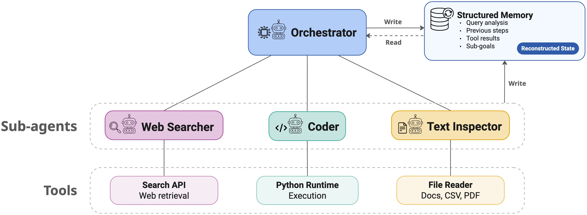

# CoSMAS - Collaborative Small-Agent System

MSc thesis research framework for evaluating **multi-agent collaboration with
small LLMs**.

CoSMAS asks one question: when a small model is given planning, structured
memory and tool sub-agents, does it actually do better - or does the machinery
just add cost? To answer that, it runs the same model, on the same benchmark,
with the same tools, in two modes:

- **AgentFlow** - a planning turn, structured memory rebuilt each turn, explicit
  sub-goals.
- **Baseline** - vanilla LLM-with-tools, a growing conversation, no planning.

One YAML key (`baseline: true`) switches between them. Everything else is held
constant, which is what makes the comparison worth anything.

**Benchmarks:** GAIA, HLE, GPQA, AIME, MATH500, AMC, MuSiQue, BigCodeBench.
**Models:** Qwen3 (0.6B–32B), DeepSeek-R1-Distill (7B, 32B), OLMo 3 (Think /
Instruct). **Backends:** vLLM (cluster), MLX (Apple Silicon), OpenAI / Anthropic.



---

## Documentation

| I want to… | Read |
|---|---|
| Understand how it works | [docs/architecture.md](docs/architecture.md) |
| Know what a config key does | [docs/configuration.md](docs/configuration.md) |
| Run an evaluation | [docs/pipelines/evaluation.md](docs/pipelines/evaluation.md) |
| Optimise prompts (GEPA) | [docs/pipelines/gepa.md](docs/pipelines/gepa.md) |
| Fine-tune (SFT / RL) | [docs/pipelines/sft.md](docs/pipelines/sft.md), [docs/pipelines/rl.md](docs/pipelines/rl.md) |
| Add a benchmark | [docs/guides/add-a-benchmark.md](docs/guides/add-a-benchmark.md) |
| Add a tool or sub-agent | [docs/guides/add-a-tool-or-subagent.md](docs/guides/add-a-tool-or-subagent.md) |
| Add a model family | [docs/guides/add-a-model-family.md](docs/guides/add-a-model-family.md) |
| Add an adaptation method | [docs/guides/add-an-adaptation-method.md](docs/guides/add-an-adaptation-method.md) |
| Change the RL / GEPA training data | [docs/guides/change-training-data.md](docs/guides/change-training-data.md) |
| Contribute code | [CONTRIBUTING.md](CONTRIBUTING.md) |
| Know what is broken | [docs/known-issues.md](docs/known-issues.md) |

`docs/archive/` holds superseded planning and status documents, each with a
HISTORICAL banner. They record reasoning worth keeping; their paths and numbers
are stale by definition.

---

## Install

**Cluster (conda + vLLM)** - one job builds the environment:

```bash
sbatch jobs/001_setup.job     # creates the `agent_engine` conda env, installs the project
squeue -u $USER
# log: out/setup/msc_thesis_env_setup_<job_id>.log
```

**Laptop (Apple Silicon, MLX):**

```bash
uv venv && source .venv/bin/activate
uv pip install -e '.[mlx]'
```

**Plain:**

```bash
pip install -e .          # core
pip install -e '.[vllm]'  # GPU backend
pip install -e '.[dev]'   # tests, black, isort
```

Then set API keys:

```bash
cp .env.example .env
```

`SERPER_API_KEY` **or** `TAVILY_API_KEY` is required (whichever matches
`web_tool_provider`; Serper is the default). `HF_TOKEN` is needed for gated
datasets. `OPENAI_API_KEY`, `ANTHROPIC_API_KEY` and `WANDB_API_KEY` are optional.

Datasets:

```bash
sbatch jobs/002_download_datasets.job          # all of them, on the cluster
python scripts/download_datasets.py --dataset gaia     # or one at a time
```

---

## Run one experiment

```bash
python scripts/run_experiment.py --config experiments/configs/qwen3/agentflow/gaia.yaml
```

`--config` is required. Override the output location rather than overwriting a
previous run:

```bash
python scripts/run_experiment.py --config <config>.yaml --output-dir ./experiments/results/my_run
```

On a laptop, the `local/` configs use small models and need no cluster:

```bash
python scripts/run_experiment.py --config experiments/configs/local/qwen3_4b_gaia.yaml
```

A whole suite:

```bash
./experiments/scripts/run_all_in_folder.sh experiments/configs/qwen3/baseline
./experiments/scripts/run_all_in_folder.sh experiments/configs/qwen3/baseline --local
```

Each run writes a timestamped directory containing `raw_results.json`,
`metrics.json`, `config.json` and `experiment.log`. A surviving
`raw_results.partial.json` means the run **did not finish**.

```bash
python scripts/analyze_results.py experiments/results/<run>/raw_results.json --by-level --tools
```

See [docs/pipelines/evaluation.md](docs/pipelines/evaluation.md) for what the
numbers mean and how to read a bad one.

---

## Repo map

```
src/
  agent_engine/        the framework
    config/            YAML schema + loader
    core/              orchestrator, execution state, tool base, batching
    models/            model families + vLLM / MLX / API providers
    tools/             web_search, code_generator, mind_map, text/image inspector, registry
    datasets/          loaders, DatasetSpec table, evaluators
    prompts/           templates/ + builder
    runner/            experiment loop, providers, tool wiring, metrics
    external/          serper, tavily, url_fetcher
    caching/           search + URL cache
    analysis/          failure-mode classifier and analyses over recorded runs
    utils/             tool-call parsing, logging, seeding
  fine_tuning/         RL (GRPO) + SFT; agentflow/ is vendored - see its VENDORED.md
  gepa_integration/    prompt optimisation
  verl_ext/            local verl extensions (folded SFT dataset, checkpoint utils)

scripts/               run_experiment, analyze_results, generate_configs,
                       download_datasets, export_prompts, GEPA + SFT + RL tooling,
                       plots/, tables/, failure_modes/ (CLI shims)
experiments/
  configs/             YAML configs by model family; most are generated
  scripts/             run_all_in_folder.sh
  results/             default output root
jobs/                  SLURM scripts - 001-007 setup, fine_tuning/, gepa/, grpo_inference/
tests/                 unit/ + characterization/ (behaviour-locking fixtures)
examples/              one runnable script per tool
docs/                  see the table above
```

---

## Concepts worth knowing before changing anything

**Everything is batched.** The unit of execution is a batch of questions, not a
question. Each turn is one `generate()` call across every unfinished question.
`batch_size: 1` turns this off, which is the setting for debugging.

**AgentFlow never shows the model its own past output.** The prompt is rebuilt
each turn from a query analysis plus an action history. Baseline grows a
conversation. They use *different prompt template files* - `*_dataset*.yaml` vs
`*_baseline*.yaml` - so changing one does not change the other.

**Most configs are generated.** Editing a generated YAML works until someone
runs `python scripts/generate_configs.py`, which silently reverts it. Change the
generator.

**A typo'd config key is silently ignored.** The schema does not forbid extra
keys, so a misspelling means the default is used and nothing warns you.

**The tool and dataset seams are registries, not if/elif chains.** Adding either
means adding a decorated factory or a spec row - never editing the orchestrator.

---

## Tests

```bash
pytest -q                      # from the repo root
pytest tests/unit -q
pytest tests/characterization -q
```

`tests/characterization/` locks current behaviour against committed fixtures. If
one fails, a refactor changed behaviour - investigate before regenerating the
fixture. See [CONTRIBUTING.md](CONTRIBUTING.md).

---

## Cluster notes (Snellius / SURF)

Working directory is `$HOME/azywot/msc-thesis/`.

| Job | Purpose |
|---|---|
| `jobs/001_setup.job` | Create the conda env, install the project |
| `jobs/002_download_datasets.job` | Download benchmark datasets |
| `jobs/003_run_examples.job` | Smoke-test a single example |
| `jobs/004_export_env.job` | Export conda env YAMLs |
| `jobs/005_export_prompts.job` | Export prompt templates + tool schemas |
| `jobs/006_create_configs.job` | Regenerate all experiment configs |
| `jobs/007_add_bigcodebench_libs.job` | Extra libraries for BigCodeBench |
| `jobs/fine_tuning/` | SFT and RL training - see the pipeline docs |
| `jobs/gepa/` | GEPA data prep, smoke tests, optimisation |
| `jobs/grpo_inference/` | Evaluation of base / SFT / GRPO checkpoints |

Overrides via `sbatch --export=ALL,...`: `ENV_NAME`, `PROJECT_DIR`, `DATA_DIR`.
