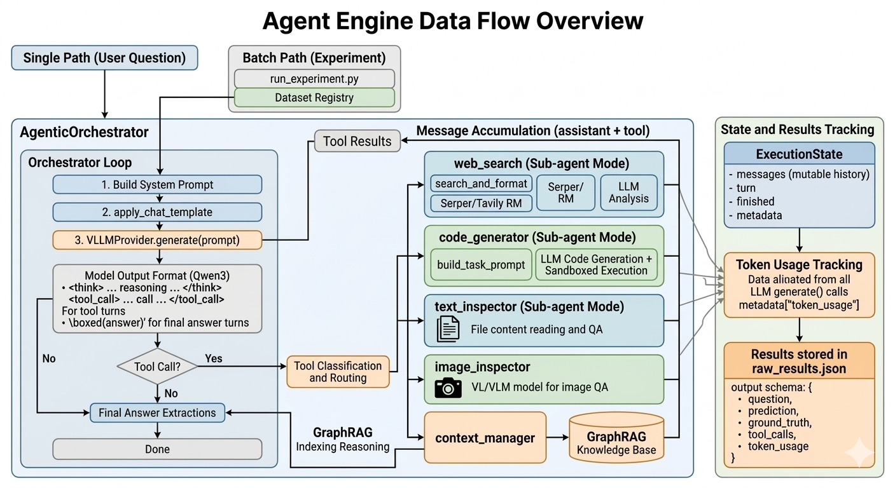

# Agent Engine — Prompt, State & Message Flow

This document describes the complete data flow: how messages are built, how
prompts are formatted, what each model sees, and how tool results return to the
orchestrator.

---

## Table of contents

1. [High-level picture](#1-high-level-picture)
2. [ExecutionState](#2-executionstate)
3. [Initial messages](#3-initial-messages)
4. [System prompt format](#4-system-prompt-format)
5. [Prompt rendering](#5-prompt-rendering-apply_chat_template)
6. [Structured memory and per-turn prompt](#6-structured-memory-and-per-turn-prompt)
7. [Orchestrator loop](#7-orchestrator-loop-per-turn)
8. [Model output format (Qwen3)](#8-model-output-format-qwen3)
9. [Tool call format and injection](#9-tool-call-format-and-injection)
10. [Sub-agent: web_search](#10-sub-agent-web_search)
11. [Sub-agent: code_generator](#11-sub-agent-code_generator)
12. [Sub-agent: text_inspector](#12-sub-agent-text_inspector)
13. [Sub-agent: image_inspector](#13-sub-agent-image_inspector)
14. [Tool: mind_map](#14-tool-mind_map)
15. [state.messages — fixed at two entries](#15-statemessages--fixed-at-two-entries)
16. [Token usage tracking](#16-token-usage-tracking)
17. [Results stored in raw_results.json](#17-results-stored-in-raw_resultsjson)
18. [GPU / model assignment summary](#18-gpu--model-assignment-summary)
19. [Experiment runner flow](#19-experiment-runner-flow)
20. [Reasoning context module](#20-reasoning-context-module)

---

## 1. High-level picture



### Batch path (experiments)

```
run_experiment.py
  ├─ load_experiment_config(config_path)
  ├─ DatasetRegistry.get(config.dataset)  → BaseDataset
  ├─ dataset.get_subset(subset_num)  → List[DatasetExample]
  ├─ PromptBuilder.build_system_prompt(dataset_name, tool_schemas, ...)
  ├─ setup_tools(config, cache_manager, ...)  → ToolRegistry
  ├─ setup_model_provider(...)  → orchestrator model (cached)
  └─ AgenticOrchestrator.run_batch(questions, question_ids, system_prompts, attachments)
       ├─ [Turn 0] _run_planning_turn(states)  → state.query_analysis
       └─ [Turn 1..N] _process_batch_turn(active_states)
             ├─ _build_memory_prompt(state)  →  fresh [system, user] with memory
             ├─ apply_chat_template(memory_prompt)  →  JSON payload
             ├─ VLLMProvider.generate(prompts)  →  GenerationResult.text
             ├─ parse_tool_call(text)
             └─ _classify_tool_call → dispatch:
                   ├─ web_search (sub-agent)  → _schedule_web_job → _flush_web_batch
                   │     ├─ search_and_format(query)
                   │     ├─ _fetch_urls_for_web_jobs (Serper only)
                   │     ├─ _format_results(results)
                   │     └─ _run_web_analysis_batch: LLM.generate(analysis_prompt)
                   ├─ code_generator (sub-agent)  → _schedule_code_job → _flush_code_batch
                   │     └─ _run_code_generation_batch: LLM.generate(task_prompt) → execute_code()
                   ├─ text_inspector  → _execute_tool (immediate)
                   ├─ image_inspector  → _execute_tool (immediate)
                   └─ mind_map  → _execute_tool (immediate)
```

### Single path (examples)

```
orchestrator.run(question, question_id, system_prompt, attachments)
  ├─ [Turn 0] _run_planning_turn([state])  → state.query_analysis
  └─ [Turn 1..N] loop:
        ├─ _build_memory_prompt(state)  → fresh [system, user] with memory
        ├─ apply_chat_template(memory_prompt) → generate([prompt])
        ├─ parse_tool_call(gen_result.text)
        └─ _execute_tool(tool_call, state)  → tool.execute(**arguments)
              (web_search/code_generator call their own model_provider.generate
               internally in sub-agent mode)
```

---

## 2. ExecutionState

`src/agent_engine/core/state.py`

```python
class ExecutionState(BaseModel):
    question_id: int
    question:    str
    attachments: Optional[List[str]]   # file paths for tools

    # Initial [system, user] messages — never mutated after construction
    messages: List[Dict[str, str]]     # always length 2: [system, user]
    current_output: str                # last raw model output (including <think> tags)

    # Execution tracking
    turn:     int                      # current turn number (starts at 0)
    finished: bool
    answer:   Optional[str]            # final extracted answer

    # Tool usage tracking
    tool_calls:  List[Dict]            # all tool_calls made (name + arguments)
    tool_counts: Dict[str, int]        # per-tool call count

    # Output message history (populated during execution)
    output_messages: List[Dict]        # alternating assistant/tool turns; final assistant turn appended on finish

    # Structured memory (AgentFlow-aligned)
    query_analysis: str                # set once by planning turn (Turn 0)
    action_history: List[Dict]         # grows by one entry per tool call

    metadata: Dict[str, Any]           # error, max_turns_reached, token_usage, etc.
```

`messages` is initialised to `[system, user]` and **never grows**.
All evolving state is in `query_analysis` and `action_history`, which are
injected into a fresh `[system, user]` prompt each turn by `_build_memory_prompt`.

---

## 3. Initial messages

Built by `_build_initial_messages(question, system_prompt, attachments)`:

```
messages = [
  {"role": "system", "content": <system_prompt>},
  {"role": "user",   "content": <question> [+ attachment note]},
]
```

**Attachment note** (appended to user message when a file is attached):

```
[Attachment]
- There is an attached file for this question: <filename>
- To inspect the image, call the tool `image_inspector` ...   # for images
  OR
- To read the file, call the tool `text_inspector` ...        # for text files
- Important: do NOT guess or provide file paths; inspectors use the attached file automatically.
```

---

## 4. System prompt format

Built by `PromptBuilder.build_system_prompt(dataset_name, tool_schemas, max_search_limit, direct_tool_call)`.

Templates loaded from `src/agent_engine/prompts/templates/system/<name>.yaml`.
GAIA and HLE share the `gaia` template.

Sections are joined with `\n\n`. Conditional sections depend on whether
`tool_schemas` is non-empty:

```
# When tools are provided:
<base_instruction_tools>        # tool-aware role description

# Tools
You may call one or more functions to assist with the user query.
<tools>...</tools>

Before each function call, first state your specific sub-goal within
<sub_goal></sub_goal> tags, then return the function call within
<tool_call></tool_call> XML tags:
<sub_goal>A specific, actionable goal for this step</sub_goal>
<tool_call>
{"name": <function-name>, "arguments": <args-json-object>}
</tool_call>

<example>                       # mode-specific example from YAML

<final_instructions>            # ALWAYS included (answer format, etc.)
<final_instructions_tools>      # only when tools are provided

# When no tools are provided:
<base_instruction>              # tool-free role description
<final_instructions>            # ALWAYS included
```

Each YAML template defines both `base_instruction` (no tools) and
`base_instruction_tools` (with tools), and both `final_instructions` (always)
and `final_instructions_tools` (tools only). This ensures no tool-referencing
text leaks into no-tool runs.

---

## 5. Prompt rendering (`apply_chat_template`)

### VLLMProvider

`apply_chat_template(messages, use_thinking)` does **not** call the tokenizer
directly. It returns a JSON envelope:

```json
{"messages": [...], "use_thinking": true|false}
```

Inside `_generate_text`, this envelope is unpacked and the tokenizer template
is applied:

```python
# Qwen3 with thinking=True
tokenizer.apply_chat_template(msgs, tokenize=False,
                               add_generation_prompt=True, enable_thinking=True)
# Qwen3 without thinking / all other models
tokenizer.apply_chat_template(msgs, tokenize=False,
                               add_generation_prompt=True, enable_thinking=False)
```

The rendered string is tokenized, truncated if `prompt_tokens > max_model_len`,
then passed to `llm.generate()`.

---

## 6. Structured memory and per-turn prompt

The orchestrator uses AgentFlow-style structured memory instead of replaying
the full conversation history. Every turn, `_build_memory_prompt` constructs a
**fresh 2-message prompt** from the accumulated memory fields:

```python
def _build_memory_prompt(state, system_prompt):
    parts = [state.messages[1]["content"]]   # original question + attachments

    if state.query_analysis:
        parts.append(f"\n**Query Analysis:**\n{state.query_analysis}")

    if state.action_history:
        parts.append(f"\n**Previous Steps:**\n{_format_action_history(...)}")

    return [
        {"role": "system", "content": system_prompt},   # unchanged every turn
        {"role": "user",   "content": "\n".join(parts)},
    ]
```

### Planning turn (Turn 0)

Before the main loop, `_run_planning_turn` runs a single generation with a
planning suffix appended to the user message (shallow copy only — `messages[1]`
is not modified):

```
[system: system_prompt]
[user:   question + "\n\nBefore using any tools, analyze this query..."]
```

The model output (thinking stripped) is stored in `state.query_analysis`.
No tool calls or answers from this turn enter `action_history`.

### Action turns (Turn 1..N)

Each turn the user message contains:

```
<original question [+ attachment note]>

**Query Analysis:**
<planning output>

**Previous Steps:**
Action Step 1:
  - Tool: web_search
  - Sub-goal: Search for Kipchoge's marathon world record time.
  - Command: {"name": "web_search", "arguments": {"query": "Eliud Kipchoge marathon world record"}}
  - Result: ...search summary...

Action Step 2:
  - Tool: code_generator
  - Sub-goal: Compute the time to run 356400 km at Kipchoge's speed.
  - Command: {"name": "code_generator", "arguments": {"task": "Calculate time in hours..."}}
  - Result: 17000
```

### action_history entry structure

```python
state.action_history.append({
    "tool_name": str,   # e.g. "web_search"
    "sub_goal":  str,   # content of <sub_goal>...</sub_goal> tag; "" if absent
    "command":   str,   # json.dumps(tool_call) — full tool call as in <tool_call>...</tool_call>
    "result":    str,   # strip_thinking_tags(tool_result.output)
})
```

---

## 7. Orchestrator loop (per turn)

### Batch path (`_process_batch_turn`)

```
for each active state s:
    s.turn += 1
    memory_prompt = _build_memory_prompt(s, system_prompt)
    prompt = apply_chat_template(memory_prompt, use_thinking)
    gen_result = model.generate([prompt])[0]
    s.current_output = gen_result.text

    tool_call = parse_tool_call(gen_result.text)

    if tool_call:
        _classify_tool_call(s, tool_call, gen_result.text, web_jobs, code_jobs, immediate_results)
    else:
        s.finished = True
        s.answer = extract_answer(gen_result.text)

# After all states processed:
_apply_immediate_results(immediate_results)
_flush_web_batch(web_jobs)
_flush_code_batch(code_jobs)
```

### Single path (`run`)

```
while state.turn < max_turns and not state.finished:
    state.turn += 1
    memory_prompt = _build_memory_prompt(state, system_prompt)
    prompt = apply_chat_template(memory_prompt, use_thinking)
    gen_result = model.generate([prompt])[0]
    state.current_output = gen_result.text

    tool_call = parse_tool_call(gen_result.text)

    if tool_call:
        _index_reasoning_in_mind_map(gen_result.text, tool_call["name"], state)
        tool_result = _execute_tool(tool_call, state)
        state.action_history.append({...})
        state.tool_calls.append(tool_call)
        state.increment_tool_count(tool_call["name"])
    else:
        state.finished = True
        state.answer = extract_answer(gen_result.text)
```

---

## 8. Model output format (Qwen3)

The model emits one of two patterns per turn:

**Tool call turn:**
```
<think>
[Extended reasoning, stripped before storing to sub-agents and results]
</think>
I need to search for ...

<sub_goal>Search for Kipchoge's marathon world record time.</sub_goal>
<tool_call>
{"name": "web_search", "arguments": {"query": "..."}}
</tool_call>
```

**Final answer turn:**
```
<think>
[Extended reasoning]
</think>
Based on the search results, the answer is \boxed{42}.
```

Parsing:
- `parse_tool_call` extracts the **last** `<tool_call>…</tool_call>` block.
- `_extract_sub_goal` extracts the `<sub_goal>…</sub_goal>` tag. Returns `""` if absent (no fallback heuristic).
- `extract_answer` looks for `\boxed{…}`, `Final Answer: …`, `Answer: …`, or `The answer is …`.
- `strip_thinking_tags` removes `<think>…</think>` before any text is shown to a sub-agent or stored in action_history results.

---

## 9. Tool call format and injection

The orchestrator passes to each tool:

```python
tool.execute(**arguments)
```

where `arguments` is built from `tool_call["arguments"]` and then modified by
one injection step.

### 9.1 Attachment path injection (`_inject_attachment_path`)

For `image_inspector` and `text_inspector`, the orchestrator injects
`full_file_path` from `state.attachments` before calling `execute`:

- **image_inspector**: first attachment with `.jpg`, `.jpeg`, `.png`
- **text_inspector**: first attachment with `.txt`, `.md`, `.log`, `.json`, `.jsonl`, `.xml`, `.csv`, `.tsv`, `.yaml`, `.yml`, `.docx`, `.xlsx`, `.jsonld`, `.parquet`, `.pdf`, `.pdb`, `.pptx`, `.py`

If no matching attachment exists, returns an error and does not call the tool.

### 9.2 Tool routing (batch path)

| Tool            | Condition                                    | Path                                      |
|-----------------|----------------------------------------------|-------------------------------------------|
| web_search      | sub-agent mode (`direct_mode=False`)         | `_schedule_web_job` → `_flush_web_batch`  |
| code_generator  | sub-agent mode (`direct_mode=False`)         | `_schedule_code_job` → `_flush_code_batch`|
| mind_map        | always                                       | `_execute_tool` (immediate)               |
| text_inspector  | always                                       | `_execute_tool` (immediate)               |
| image_inspector | always                                       | `_execute_tool` (immediate)               |

Sub-agents (web_search, code_generator) operate independently — they do **not**
receive the orchestrator's reasoning context or action history. The orchestrator
communicates intent solely via the tool call arguments (`query` / `task`).

---

## 10. Sub-agent: `web_search`

**Direct mode** (`model_provider=None`): returns formatted results string directly, no LLM call.

**Sub-agent mode** (batched path, used in experiments):

### Step A — search_and_format (before batched URL fetch)

```
SerperRM.forward(query)  →  [{title, url, content (snippet)}, ...]
  OR
TavilyRM.forward(query)  →  [{title, url, content (cleaned text)}, ...]
```

Returns payload:
```python
{
  "results":      [...],
  "urls_to_fetch": ["https://..."],   # Serper only, uncached
  "url_snippets":  {"url": "snippet"},
  "cached": bool,
  "query":  str,
}
```

### Step B — batch URL fetch (Serper only)

`fetch_page_content(urls, snippets)` fetches all URLs across all pending web
jobs in one batch using `ThreadPoolExecutor`. Content is stored in
`tool.url_cache[url]`. Tavily does not require URL fetching (content in results).

### Step C — _format_results

Produces a string of web page blocks:

```
**Web Page 1:**
{
  "title": "...",
  "url": "https://...",
  "content": "...up to max_doc_len chars extracted around best-matching sentence..."
}
**Web Page 2:**
...
```

For Serper, `content` is extracted via `extract_snippet_with_context`
(F1-based sentence matching, returns `context_chars=max_doc_len` chars around
the best-matching sentence). For Tavily, `content` is the raw Tavily field.

### Step D — sub-agent LLM call

Prompt built by `build_analysis_prompt(query, formatted_results)`:

```
**Task Instruction:**

You are tasked with reading and analyzing web pages based on the following
inputs: Current Search Query and Searched Web Pages. Your objective is to
extract relevant and helpful information ...

**Inputs:**
- **Current Search Query:**
  <query>

- **Searched Web Pages:**
  <formatted_results from Step C>

Now you should analyze each web page ...
```

Messages: `[{"role": "user", "content": <above>}]`

Output format expected:
```
**Final Information**

[Helpful information extracted from web pages]
```

`<think>…</think>` is stripped from the output before it is returned.

The cleaned text is stored in `analysis_cache[query]` (per-tool in-memory) and
stored in `action_history[i]["result"]`.

---

## 11. Sub-agent: `code_generator`

**Direct mode**: `execute(code=...)` — runs the Python code string directly, no LLM call.

Temp files: `{temp_dir}/{SLURM_JOB_ID}/temp_{counter}.py`
(falls back to `{temp_dir}/pid_{pid}/temp_{counter}.py` outside SLURM).
Counter is per-tool-instance and monotonically increasing, ensuring no
collision across parallel batch questions.

**Sub-agent mode** (batched path):

Prompt built by `build_task_prompt(task, context)`:

```
You are a code generator. Generate ONLY executable Python code, with NO
explanations, NO comments about what the code does, and NO additional text.

[Context:
<attachment context — file path and/or file content if text_inspector was called>]

Problem: <task description>

Requirements:
- Output ONLY the Python code
- The code must be executable as a standalone script
- The code must print its output directly
- ...

Python code:
```

Messages: `[{"role": "user", "content": <above>}]`

The LLM output is stripped of `<think>` tags and markdown fences, then executed
in a sandboxed subprocess with `timeout_seconds=60`. `stdout` + `stderr` is
returned as `ToolResult.output`.

**Attachment context** (MAT-style): `get_attachment_context_for_code(state)` appends:
- `[ATTACHED_FILE_PATH] {path}` — always when a text attachment exists, so the
  code generator knows where to read the file even if `text_inspector` was not called
- `<FILE_CONTENT>` — only when `text_inspector` was called, with its response (truncated to 4000 chars)

---

## 12. Sub-agent: `text_inspector`

**Direct mode**: returns raw file content (no LLM call).

**Sub-agent mode with question**:

Messages:
```python
[
  {"role": "system", "content":
      "You are given the content of a plain-text file attached to the user's question. "
      "Answer the question using only the file content. If the file does not contain "
      "the answer, say so."},
  {"role": "user", "content":
      f"File content:\n\n{file_content}\n\nQuestion:\n{question}\n"},
]
```

`<think>` stripped from output before returning.

Supported formats: `.txt`, `.md`, `.log`, `.json`, `.jsonl`, `.xml`, `.csv`,
`.tsv`, `.yaml`, `.yml`, `.docx`, `.xlsx`, `.jsonld`, `.parquet`, `.pdf`,
`.pdb`, `.pptx`, `.py`.

---

## 13. Sub-agent: `image_inspector`

Always requires a model provider (VLM). Multimodal prompt:

```python
[
  {"role": "system", "content":
      "You are given an image attached to the user's question. "
      "Answer the question using only the image content. "
      "If the image does not contain enough information, say so."},
  {"role": "user", "content": [
      {"type": "image"},
      {"type": "text", "text": f"Question:\n{question}\n"},
  ]},
]
```

`apply_chat_template` is called on these multimodal messages. The generate
call passes both the rendered prompt and `multi_modal_data={"image": pil_image}`
to vLLM.

---

## 14. Tool: `mind_map`

**Non-direct mode (sub-agent)**:

- Pre-tool reasoning from the orchestrator is indexed into a GraphRAG knowledge
  base before each `web_search`, `code_generator`, or `mind_map` call.
- Tool call arguments: `{"query": str}`.
- Returns `ToolResult.output` = retrieved context passages (up to 2000 chars).
- No LLM call inside the tool itself; GraphRAG handles retrieval.

**Direct mode**: persistent text file with `op: write|read` interface.

### How reasoning gets into the knowledge base (non-direct mode)

Before executing any `web_search`, `code_generator`, or `mind_map` call,
the orchestrator calls `_index_reasoning_in_mind_map`. It strips the
`<tool_call>…</tool_call>` block from the model output and feeds the remaining
reasoning text into `MindMapTool.add_entry(reasoning, question_id)`.

---

## 15. state.messages — fixed at two entries

`state.messages` is initialised to `[system, user]` and **stays there permanently**.
No assistant or tool messages are ever appended.

The two entries serve exactly two purposes:

| Entry | Read by | Purpose |
|---|---|---|
| `messages[0]["content"]` | `_process_batch_turn` | Extract `system_prompt` for `_build_memory_prompt` |
| `messages[1]["content"]` | `_build_memory_prompt` | Original user question + attachment notes |

All other per-turn state (model outputs, tool results, reasoning) lives in
`state.action_history` and `state.current_output`. The full conversation is
reconstructed from scratch each turn inside `_build_memory_prompt` as a fresh
`[system, user]` prompt — the model never receives a growing multi-turn history.

`state.output_messages` records the raw assistant and tool messages as they are
produced (populated by the orchestrator, not reconstructed post-hoc):

```
[
  {"role": "assistant", "content": <raw gen_result.text including <think> tags>},
  {"role": "tool", "tool_name": str, "content": <strip_thinking_tags(tool_result.output)>},
  ...
  {"role": "assistant", "content": <final answer turn>},
]
```

---

## 16. Token usage tracking

Token counts are accumulated via `_accumulate_usage(state, gen_result.usage)` in
`orchestrator.py` after every `model.generate()` call. The function writes into
`state.metadata["token_usage"]` — a plain dict that exists entirely within
the already-present `metadata` field of `ExecutionState`.

### Which generation calls are tracked

| Call site | What it tracks |
|-----------|----------------|
| `run()` — single-turn loop | Each orchestrator turn (prompt + completion) |
| `run()` — tool execution | Any tool that returns `ToolResult(usage=...)` (web_search, text_inspector, image_inspector in single-run) |
| `_process_batch_turn()` — batched loop | All orchestrator turns in a batch |
| `_apply_immediate_results()` | Tools returning `ToolResult.usage` (text_inspector, image_inspector, mind_map, web_search in direct/single path) |
| `_run_web_analysis_batch()` | Web-search sub-agent LLM analysis call |
| `_run_code_generation_batch()` | Code-generator sub-agent LLM call |

### Accumulator structure

```python
state.metadata["token_usage"] = {
    "prompt_tokens":     int,   # cumulative across all tracked calls
    "completion_tokens": int,
    "total_tokens":      int,
}
```

### Where token usage is stored and computed

| Location | What is stored | How it is produced |
|----------|----------------|--------------------|
| **In-memory (runtime)** | `state.metadata["token_usage"]` | `_accumulate_usage()` adds each `gen_result.usage` into this dict. One per `ExecutionState` (per question). |
| **raw_results.json** | `"token_usage": {...}` in each result record | Copied from `state.metadata.get("token_usage", {})` after each question completes. |
| **metrics.json** | `overall.token_usage` | Sum of `token_usage` from all result records. Computed in `_compute_metrics()`. |
| **metrics.json** | `per_level[level].token_usage` | Same sum, only over results for that level. |

---

## 17. Results stored in raw_results.json

After processing, each example produces one record:

```python
{
  "question_id":    int,
  "question":       str,
  "prediction":     str,             # extracted answer
  "ground_truth":   str,
  "correct":        bool,
  "evaluation":     dict,            # dataset-specific eval result
  "query_analysis": str,             # planning turn output
  "action_history": [                # one entry per tool call
    {
      "tool_name": str,
      "sub_goal":  str,              # from <sub_goal> tag; "" if absent
      "command":   str,              # json.dumps(tool_call["arguments"])
      "result":    str,              # strip_thinking_tags(tool_result.output)
    }
  ],
  "output_messages": [               # raw assistant/tool turns from state.output_messages
    {"role": "assistant", "content": str},
    {"role": "tool", "tool_name": str, "content": str},
    ...
  ],
  "turns":          int,
  "tool_counts":    {"web_search": int, ...},
  "token_usage": {
      "prompt_tokens":     int,
      "completion_tokens": int,
      "total_tokens":      int,
  },
  "metadata":       dict,            # from dataset example (level, file_name, etc.)
}
```

---

## 18. GPU / model assignment summary

| Role              | Model (test config)         | Thinking | Notes                          |
|-------------------|-----------------------------|----------|--------------------------------|
| orchestrator      | Qwen3-4B                    | Yes      | Drives the main loop           |
| web_search        | Qwen3-4B (shared)           | No       | Analyzes fetched pages         |
| code_generator    | Qwen3-4B (shared)           | No       | Generates Python code          |
| text_inspector    | Qwen3-4B (shared)           | No       | Reads/answers about text files |
| mind_map          | Qwen3-4B (shared)           | No       | GraphRAG entity extraction     |
| image_inspector   | Qwen/Qwen3-VL-4B-Instruct   | No       | Multimodal VLM                 |

Model instances sharing the same `path_or_id` are reused (single vLLM engine
for all Qwen3-4B roles). GPU assignment is computed by
`resolve_gpu_assignments`: each distinct model path gets its own GPU(s) with
memory utilization = `0.9 / num_distinct_models_on_same_gpu`.

When no separate model is configured for a tool role, `run_experiment.py`
falls back to the orchestrator model instance (same vLLM engine, serialised
via a shared lock).

---

## 19. Experiment runner flow

`scripts/run_experiment.py`

### Input

- Config file (YAML) via `--config`
- Dataset: `dataset.name`, `dataset.split`, `dataset.subset_num`

### Flow

1. **Load config** — `load_experiment_config(config_path)`
2. **Load dataset** — `DatasetRegistry.load(config.dataset)` → `List[DatasetExample]`
3. **Build system prompt** — `PromptBuilder.build_system_prompt(dataset_name, tool_schemas, max_search_limit, direct_tool_call)`
4. **Setup tools** — `setup_tools(config, cache_manager, api_keys, model_providers, ...)` → `ToolRegistry`
5. **Setup orchestrator model** — `setup_model_provider(orchestrator_config)` (cached)
6. **Create orchestrator** — `AgenticOrchestrator(model_provider, tools, max_turns, tool_limits, use_thinking, cache_manager)`
7. **Process in batches** — `orchestrator.run_batch(questions, question_ids, system_prompts, attachments)`
8. **Evaluate** — `dataset.evaluate(prediction, ground_truth, metadata)` per example
9. **Write outputs** — `raw_results.json`, `metrics.json`, `config.json`

### Run directory

`{output_dir}/{split}_{YYYY-MM-DD-HH-MM-SS}_{job_id}/`

- `raw_results.json` — per-example results
- `raw_results.partial.json` — intermediate flush (every 10 batches)
- `metrics.json` — aggregated accuracy, token usage, per-level stats
- `config.json` — experiment config + system prompt

### Partial flush

Every 10 examples (when `(base_idx + len(batch)) % 10 == 0`), `raw_results.partial.json`
is written and `cache_manager.save_caches()` is called.

---

## 20. Reasoning context module

`src/agent_engine/utils/reasoning_context.py`

Provides attachment context to `code_generator` sub-agents (MAT-style).
Sub-agents do **not** receive the orchestrator's reasoning history or action
history — they operate independently on their task/query arguments only.

### Functions

| Function | Purpose |
|----------|---------|
| `get_attachment_context_for_code(state)` | Build attachment context string for code_generator |

### Attachment context for code (MAT-style)

- **Path**: always included when a text attachment exists — so the code
  generator knows where to read the file even if `text_inspector` was not called
- **Format**: `[ATTACHED_FILE_PATH] {path}` (full absolute path via `os.path.abspath`)
- **Content**: only when `text_inspector` was called — last tool response,
  truncated to 4000 chars, wrapped in `<FILE_CONTENT>`

### Injection point

`get_attachment_context_for_code(state)` is called in `_schedule_code_job`
(batch path) and passed as `context` to `build_task_prompt`.
